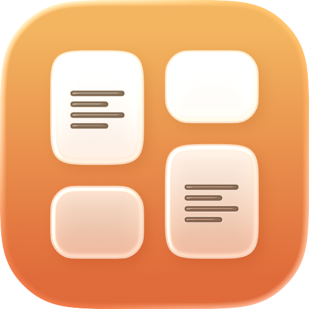
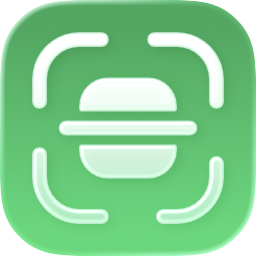

## 

I build apps across web, iOS, and desktop.

Mostly React and Next.js, but I'll use whatever gets the product shipped
properly.

🌐 **[archisvaze.com](https://archisvaze.com)** - Check out my website!

---

### Things I like to use a lot

---

### Download my iPhone apps!

  
  &nbsp;&nbsp;
  

---

### Writing

- [Texget App Review: An Insanely Powerful Widget App](https://archisvaze.hashnode.dev/texget-app-review-an-insanely-powerful-widget-app)
- [Texget App Journey (Founder Story)](https://archisvaze.hashnode.dev/texget-app-journey-founder-story)
- [Whiteboard Fox: A Simple And Powerful Online Whiteboard for Collaboration](https://archisvaze.hashnode.dev/whiteboard-fox-a-simple-and-powerful-online-whiteboard-for-collaboration)
- [Dynamic Text Color Adjustment with React Hooks](https://archisvaze.hashnode.dev/dynamic-text-color-adjustment-with-react-hooks)
- [A simple React alert component](https://archisvaze.hashnode.dev/a-simple-and-customizable-react-alert-component)

---

### Stats

<!-- **archisvaze/archisvaze** is a ✨ _special_ ✨ repository because its `README.md` (this file) appears on your GitHub

Here are some ideas to get you started:

- 🔭 I’m currently working on ...
- 🌱 I’m currently learning ...
- 👯 I’m looking to collaborate on ...
- 🤔 I’m looking for help with ...
- 💬 Ask me about ...
- 📫 How to reach me: ...
- 😄 Pronouns: ...
- ⚡ Fun fact: ... -->
